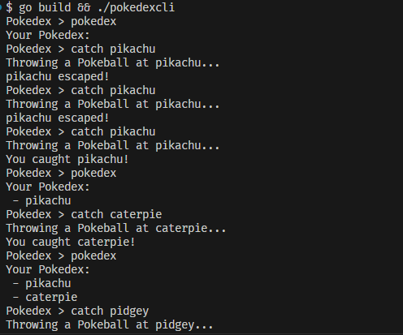

# pokedex

A simple CLI pokedex written in Go using the [PokeAPI](https://pokeapi.co/).

An User can:

- using 'help' command to see all available commands
- using 'catch' command to catch a pokemon
- using 'inspect' command to inspect a pokemon
- using 'explore' command to explore a pokemon
- using 'pokedex' command to see all caught pokemons
- using 'map' command to see next 20 area map
- using 'mapb' command to see previous 20 area map
- using 'exit' command to exit the program

## Usage

```bash
go build .
./pokedex
```

## Example

